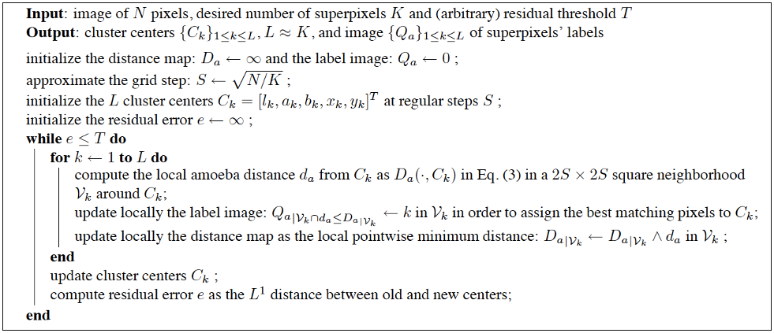

amoeba
======

Amoeba-based superpixel partitioning of multispectral images
---

**About**

We implement an algorithm for scene segmentation (full detail [here](paper.ipynb)) that:
* forms a one-to-many partitioning (_"over-segmentation"_) of features in the scene into smaller segments of distinct spectra,
* works essentially like a _kmeans_ based local clustering and aggregating of pixels, and 
* local redundancy in the data, by reducing noise and variability while enforcing connectivity,

so that it can efficiently generate compact, connected, nearly uniform and perceptually meaningful segments (_"superpixels"_) . 

**Usage** 

The documentation of the algorithm, including a full description of the required/optional input/output parameters, is available at: [**amoebasuperpix.html**](../../segmentation/amoebasuperpix.html). The stepwise implementation of the algorithm is further described at: [**amoebasuperpix_base.html**](../../segmentation/amoebasuperpix_base.html).

To reproduce the experiments, you will need to:
* install Matlab ad-hoc package [**`imtools`**](https://gjacopo.github.io/imtools/); _e.g._, add the paths of the install to your `pathdef.m` setup file;
* run the function [**`amoebasuperpix.m`**](../../segmentation/amoebasuperpix.m) with desired arguments.
* run [`slicsuperpix`](../../segmentation/slicsuperpix.html) or [`geosuperpix`](../../segmentation/geosuperpix.html) for comparison with similar approaches.

See some examples of generated outputs [here](paper.ipynb).

Details about the actual implementation of the gradient tensor decomposition are given in the documentation of functions [`gstdecomp`](../../derive/gstdecomp.html) [`gstfeature`](../../derive/gstfeature.html). The technique used for fast implementation of Dijkstra's algorithm is described in the source code [`dijkstrapropagation_mex.cpp`](../../propagation/src/dijkstrapropagation_mex.cpp). Note that it refers to Kirk's implementation of [Dijkstra's Minimum Cost Path package](http://nl.mathworks.com/matlabcentral/fileexchange/20025-dijkstra-s-minimum-cost-path-algorithm) as well as Peyre's [Toolbox Graph](https://nl.mathworks.com/matlabcentral/fileexchange/5355-toolbox-graph/). See also [dijkadvanced](../../graph/dijkadvanced.html). Altogether, all mentioned dependencies are solved when loading the `imtools` package.   

**Description**

In practice, the approach is based on the estimation of amoeba-like neighborhoods [[LDM07]](#LDM07) around selected cluster centers [[ASSLFS12]](#ASSLFS12) that exploit the connections between successive image pixels along geodesic paths in the image [[GS09]](#GS09). The resulting superpixels capture the spatial/spectral redundancy and greatly reduce the complexity of subsequent image processing tasks [[RM03]](#RM03). They provide convenient primitives from which to compute local image features when objects present in the scene have diverse scales or when they are not known in advance [[MPWMJ08]](#MPWMJ08). 

A detailed description of the approach is available on this [**notebook**](paper.ipynb). The algorihtm is schematically described below:

.

**References** 

* <a name="ASSLFS12">Achanta R., Shaji A., Smith K., Lucchi A., Fua P., and Susstrunk S. (2012): [**SLIC superpixels compared to state-of-the-art superpixel methods**](http://www.kev-smith.com/papers/SMITH_TPAMI12.pdf), _IEEE Transactions on Pattern Analysis and Machine Intelligence_, 34(11):2274–2282, doi:[10.1109/TPAMI.2012.120](http://dx.doi.org/10.1109/TPAMI.2012.120).
* Grazzini J., Dillard S., and Soille P. (2010): [**Multichannel image regularisation using anisotropic geodesic filtering**](http://ieeexplore.ieee.org/xpls/abs_all.jsp?arnumber=5596008), in _Proc. IEEE ICPR_, pp. 2664-2667, doi:[10.1109/ICPR.2010.653](http://dx.doi.org/10.1109/ICPR.2010.653).
* Grazzini J. and Soille P. (2009): [**Edge-preserving smoothing using a similarity measure in adaptive geodesic neighbourhoods**](http://www.sciencedirect.com/science/article/pii/S003132030800469X), _Pattern Recognition_, 42(10):2306-2316, doi:[10.1016/j.patcog.2008.11.004](http://dx.doi.org/10.1016/j.patcog.2008.11.004).
* Lerallut R., Decenciere E., and Meyer F. (2007): **Image filtering using morphological amoebas**, _Image and Vision Computing_, 25(4):395–404, do:[10.1016/j.imavis.2006.04.018](http://dx.doi.org/10.1016/j.imavis.2006.04.018).
* Moore A.P., Prince S., Warrell J., Mohammed U., and Jones G. (2008): [**Superpixel lattices**](http://mplab.ucsd.edu/wordpress/wp-content/uploads/CVPR2008/Conference/data/papers/131.pdf), in _Proc. IEEE CVPR_, pp. 1–8, doi:[10.1109/CVPR.2008.4587471](http://dx.doi.org/10.1109/CVPR.2008.4587471).
* Ren X. and Malik J. (2003): [**Learning a classification model for segmentation**](https://www.cs.cmu.edu/~efros/courses/LBMV07/Papers/ren-iccv-03.pdf), in _Proc. ICCV_, pp. 10–17.
